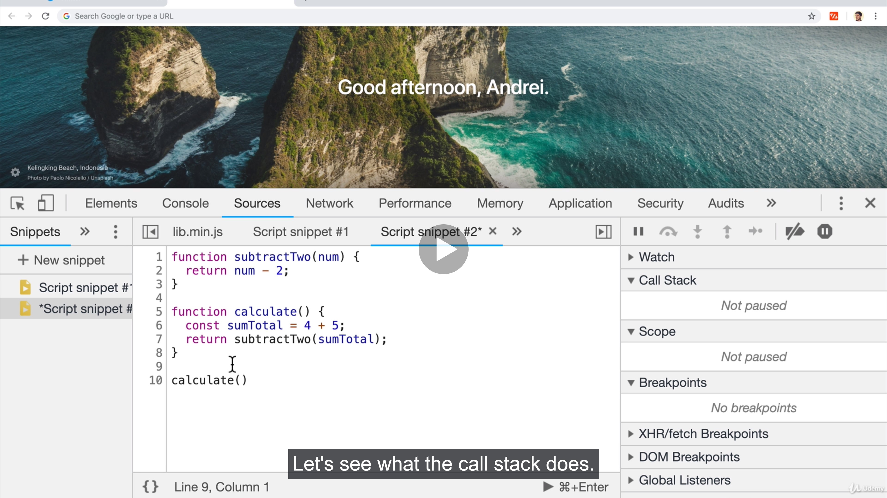

# Call Stack and Memory Heap

### To do that, we need

1. A place to store and write information that is to store our variables, our objects, and our data of our apps.
2. A place We need to run and keep track of what's happening line by line on our code

### We use Call stack and Memory heap for that!!

- Memory Heap: A place to store and write information. We have a place to allocate memory, use memory and release memory

- Call Stack: A place to keep track of where we are in the code. So we can run the code in order.

- Memory Heap is just a place for us to store our information / data .

- The stacks allows us to know where we are in the code and it runs in a first in last out mode
