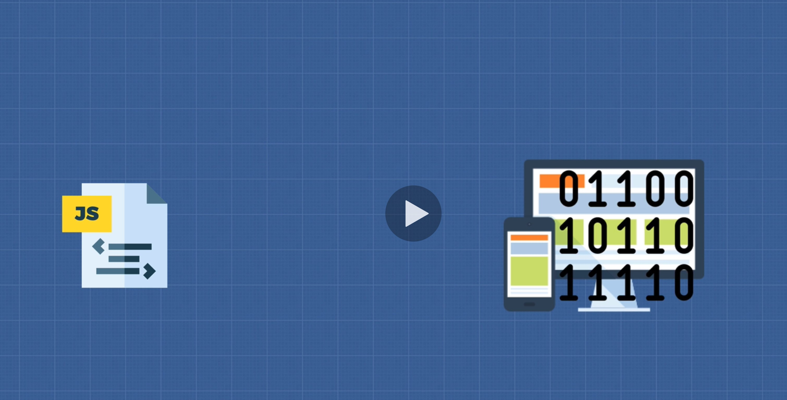
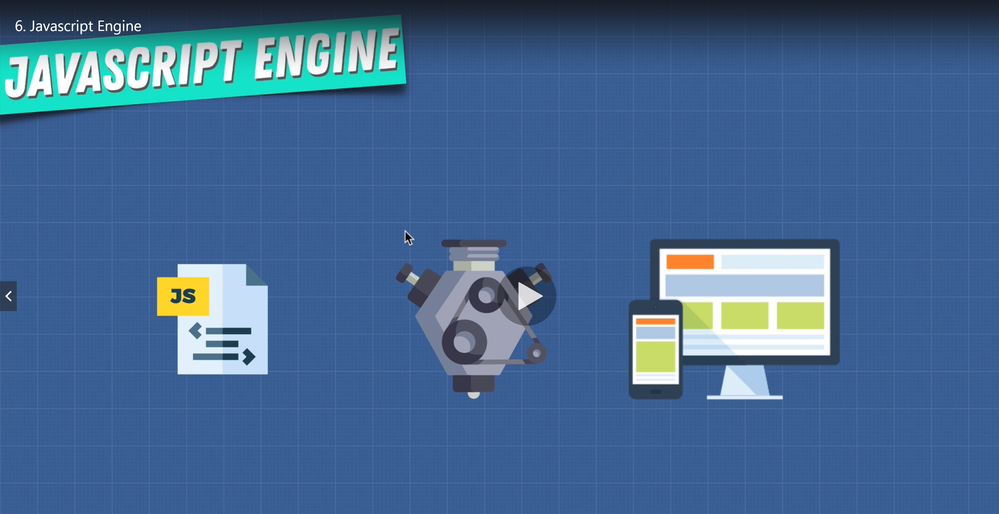
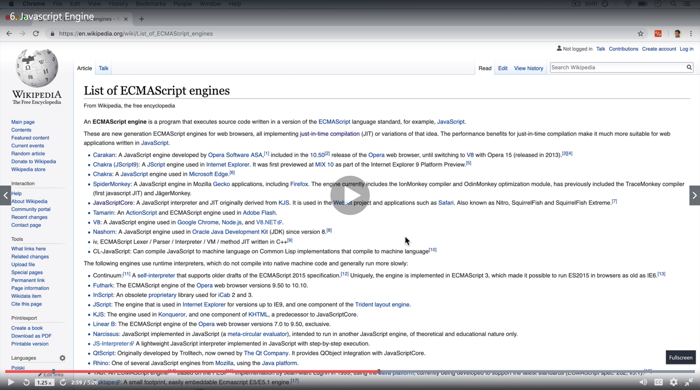

# Javascript Engine

## Computers will only understand only 0s and 1s

 

### Computers will never understand what JS files are talking about

---

 

### How are we going to communicate with the computer using a JS file? That's how JS engines comes in

 
 

### Like a variety of vehicle engines, there are a lot of JS engines out there

