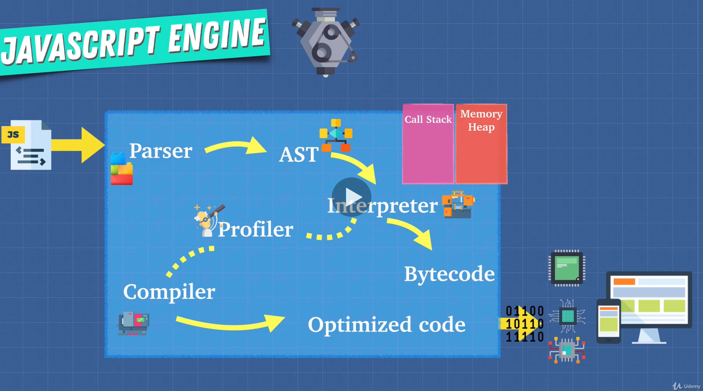
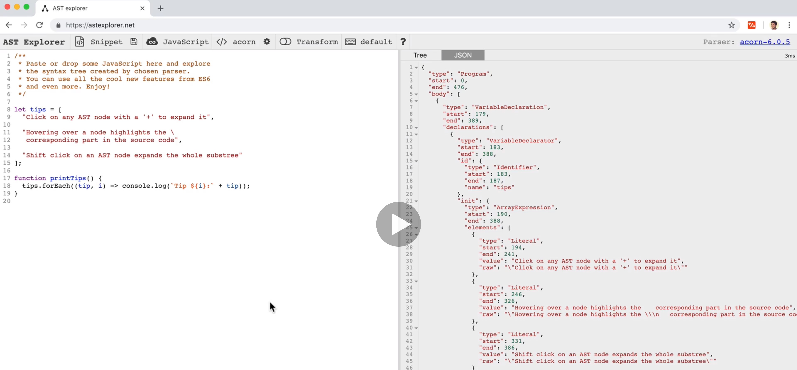
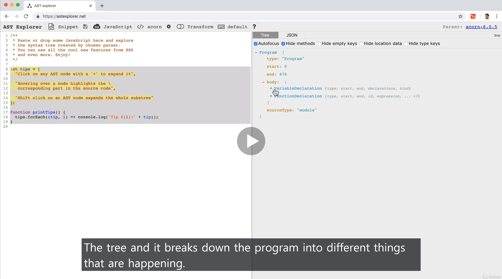
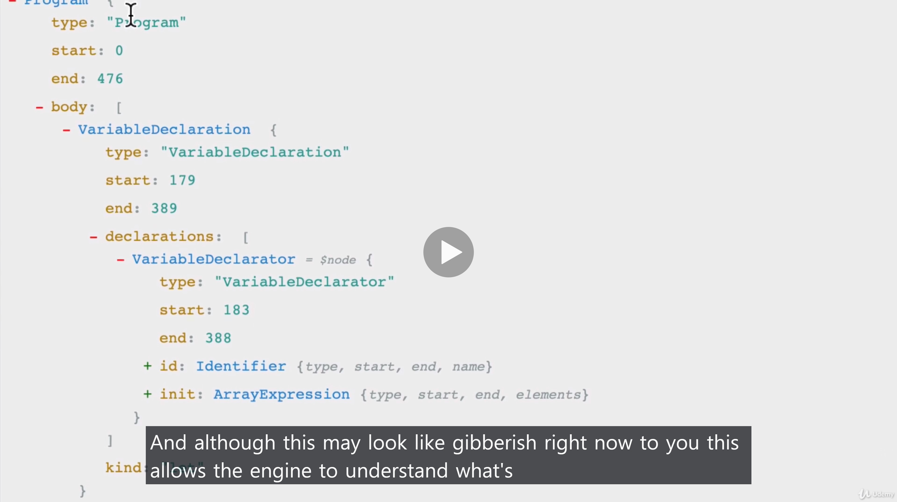
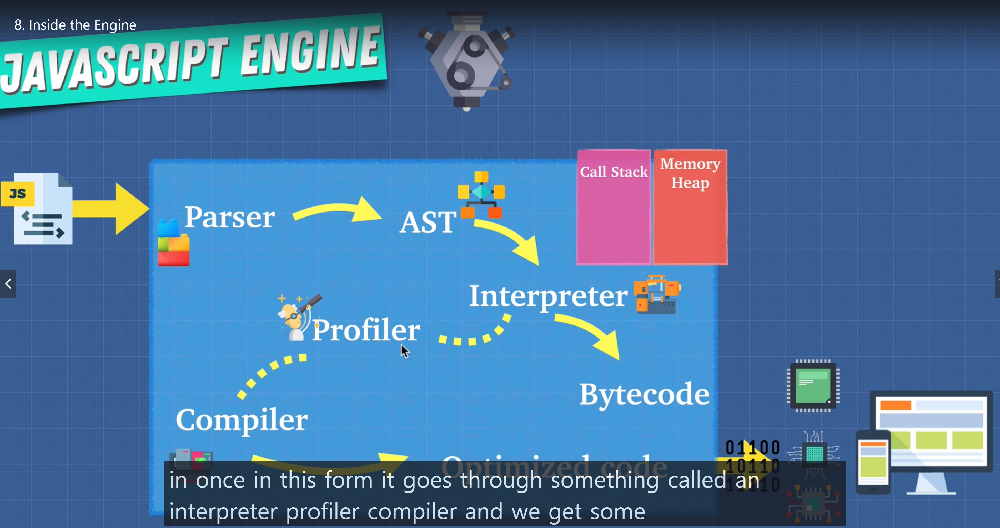
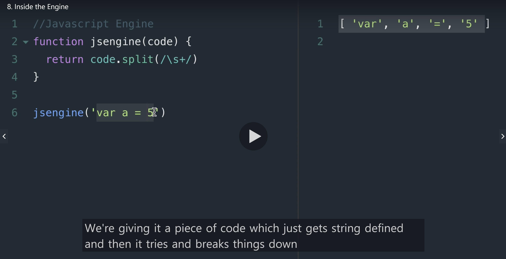

# What's happening inside of this engine?

## Inside the engine it looks like this

 
 

### First what it does is LEXICAL ANALYSIS

- which breaks the code into token to identify their meaning
- Then, the tokens will be formed into AST (Abstract Syntax Tree)

> So we parse the code trying to figure out how the text is divided upto and it gets formed into tree like AST.

 

### Access to this website and play with AST [here](https://astexplorer.net/)

> And this whole engine will spit out the code that our CPU is going to understand to give it instructions

> Let's create a SIMPLE JS engine.
