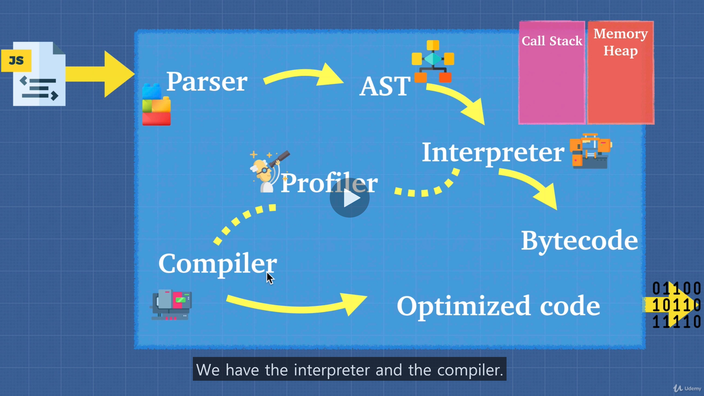

# JS Engine For All

## If anyone can create JS Engine, it will be mess.

### That's why ECMAScript engines was created

- Standard of Javascript Engine
- It tells enginee creators this is how JS should work.
- But internally it is up to you how you build the engine as long as you conforms to the standards

### As long as you understand the principles and why it's built the way it is, we are going to be able to understand how to write optimized code.

