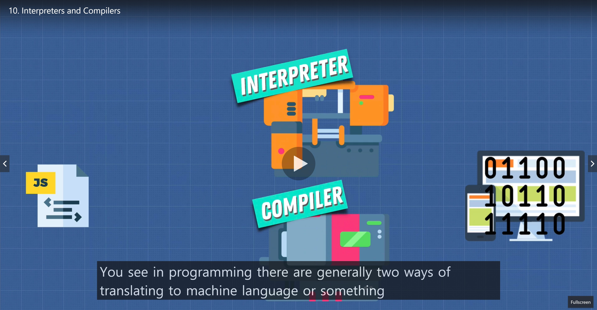
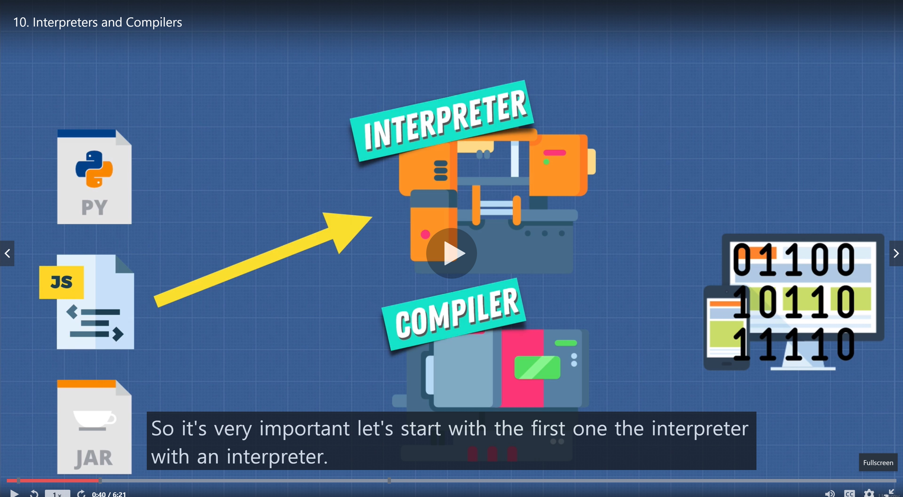
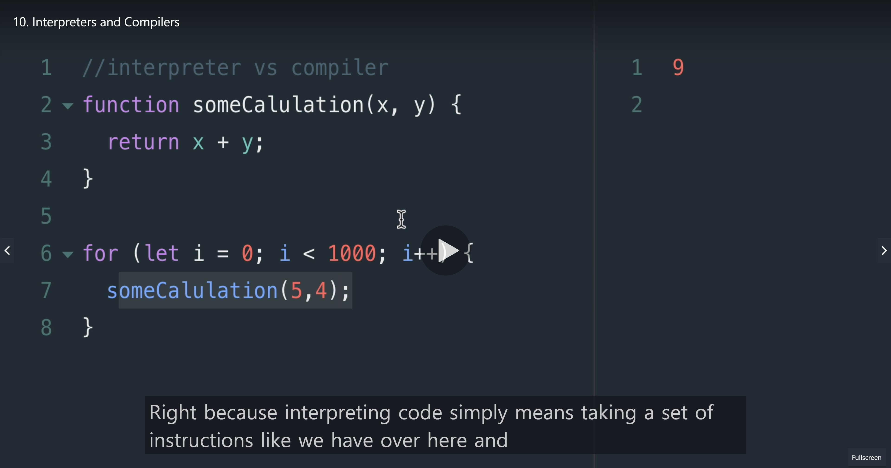
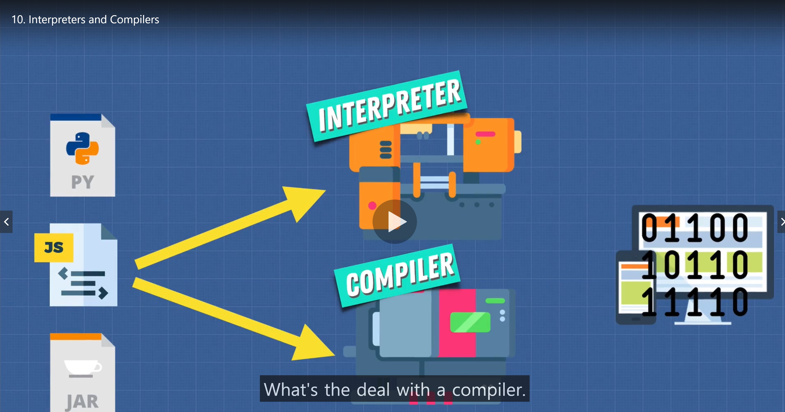
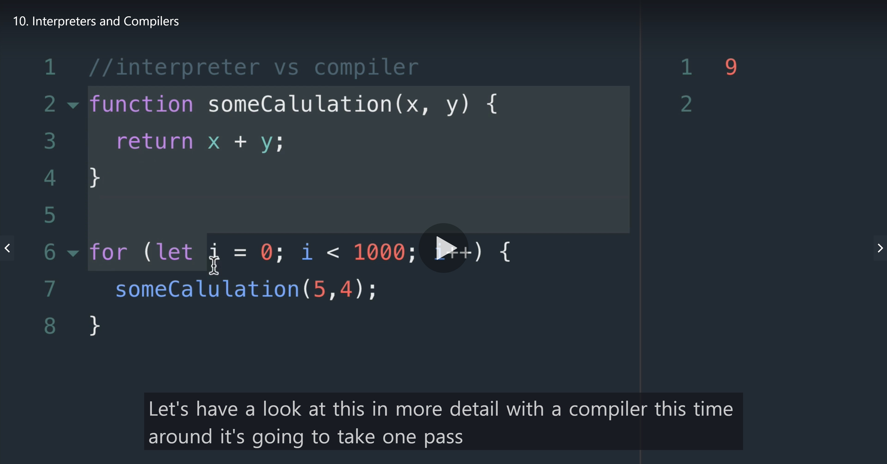
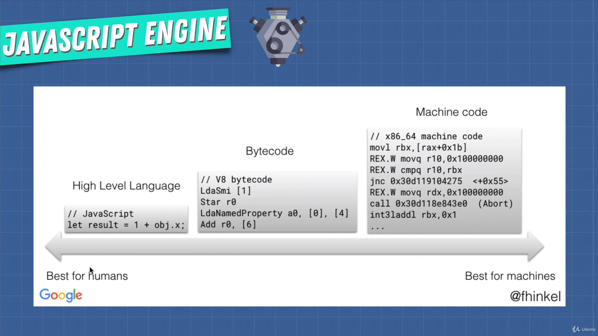
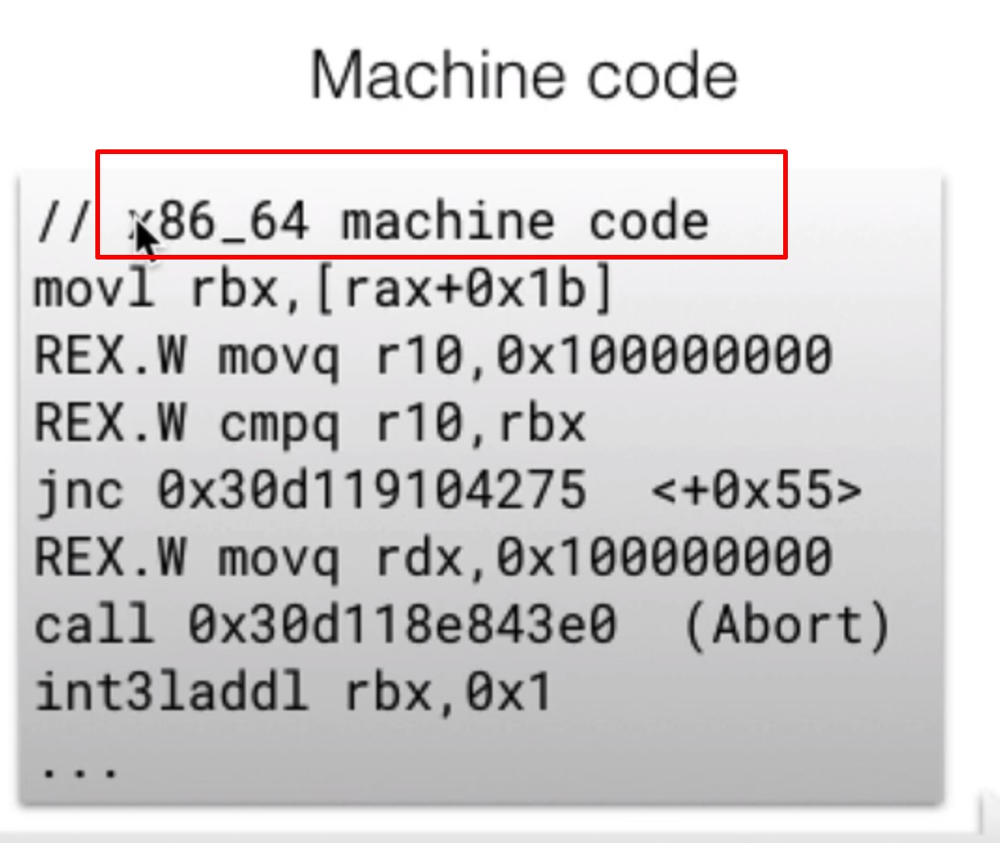

# Interpreters and Compilers

 

## With an interpreter

### We translate and read the files **line by line**

 

## What about a compiler?

- Compiler unlike interpreter doesn"t translate on the fly.
- It works ahead of time!! to create a translation of what code we've just written and it **compiles down** to a language that our machines can understand

- It's gonna take one pass through the code
- and try to understand what the code does
- and It's gonna take the program in Javascript or any type of language and write a new program in your new language

## In some respects all languages have to be interpreted and compiled. Why?

- It has to get translated into low level language like machine code

## Here x86 code which is machine code

1. this is handed off to the CPU
2. and it needs to interpret these instructions
3. In reality x86 is actually too slow to be interpreted literally
4. So instead most modern CPU use will **Compile** this x86 code into its own native micro code

## The main takeaway is this:

### There are two ways to run javascript using an interpreter or a compiler
