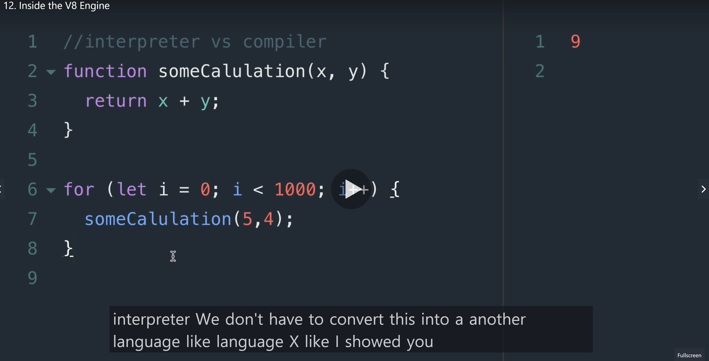
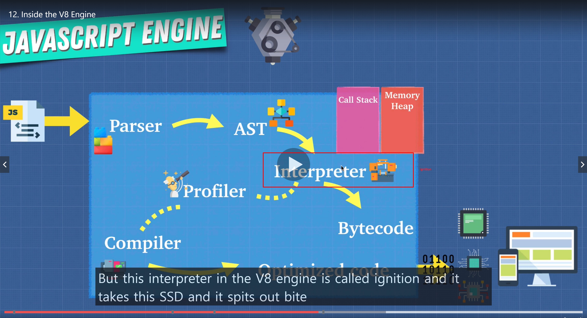

# Inside the V8 Engine

## Let's have a look at the pros and cons of each

### Interpreters:

- Quick to get up and running

- There's no compilation step before we can start running our code.
- Because of this an interpreter is a natural fit for something like Javascript.
- Javascript file get sent from the server to the browser to the client on the front end
- We want that JS to execute right away. Because our users are gonna be waiting on the web page trying to interact with our application.
- Javascript was created for browsers.
- So being able to interpret JS and run it asap, that was an ideal

### This is why JS used interpreters at the beginning

### But there's a con with using an interpreter

- Googlemaps: Running a lot of JS, it will get slower

- for example if yoou're in a loop, it can get slow.

## The compiler helps us here

- It takes a little bit more time to start up, because it has to go through that compilation step at the beginning
  > Go through our code, undertand it and spit it out into another language

- Compiler can simplify the code instead of calling the function multiple times

- Because a compiler doesn't need to repeat the translation for each pass through, the code is faster.

- and these sort of edits that compilers do are called **OPTIMIZATION**

## Is there a way that we can get the best of both worlds?

### This is V8 engines comes in:

- Combine these two and create **JIT**(Just In Time) Compiler

## Let's see how V8 engine works underneath the hood

1. The interpreter in V8 engine is called: Ignition
2. It takes the AST and it spits out **BYTECODE**
3. The profiler in compiler monitors and watches our code as it runs
4. It makes notes on how we can optimize this code such as how many times it is being run, what types are used.
5. Using this profiler as the code is running through our interpreter which tells our browser what to do
6. If the same lines of code are run a few times, we **pass off** some of this code to the **compiler**
7. Because as the code is running, the interpreter is gonna say 'Here are some code for you to optimize' passing it off to the compiler.
8. The compiler as the app is running takes a code and compiles/modifies it, it is trying to make optimization. So it runs faster
9. Then it replaces the sections where it could be improved of the bite code with optimized machine code so that optimized code is used from that point instead of the slower byte code.

- The profiler in the compiler are constantly making updates and changes to our byte code
- the compiler in V8 is called Turbo Fan.
