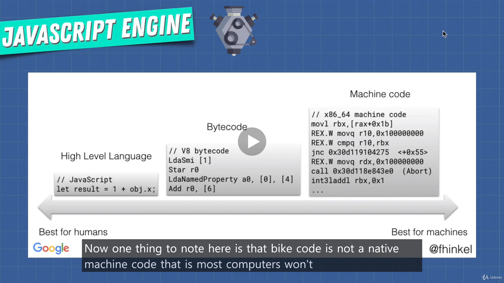

# Comparing Other Languages

## Java :

### It uses JVM(Java Virtual Machine) whiere it compiles your code to byte code inside of the JVM. And then it's going to understand byte code.

- Unlike a compiled language that has to be compiled for each specific type of computer, java program only needs to be converted to byte code once.
- And then byte code can be understood by JVM.

- Byte code is not a native machine code.
- So with byte code you need software such as the virtual machine or a JS engine so we can execute it directly.

 

## Is JS an interpreted language?

### Yes, initially when it first came out, the engine such as spidermonkey interpreted javascript to byte code.

 

## But things have evolved now!

### We also use compilers to optimize the code
