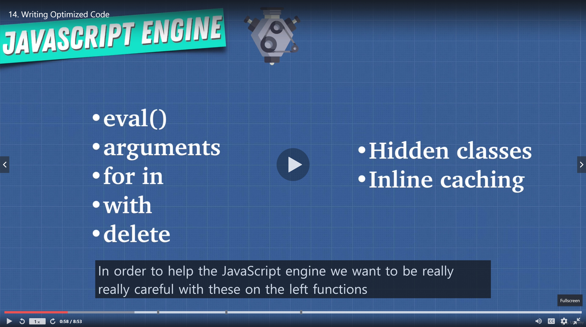
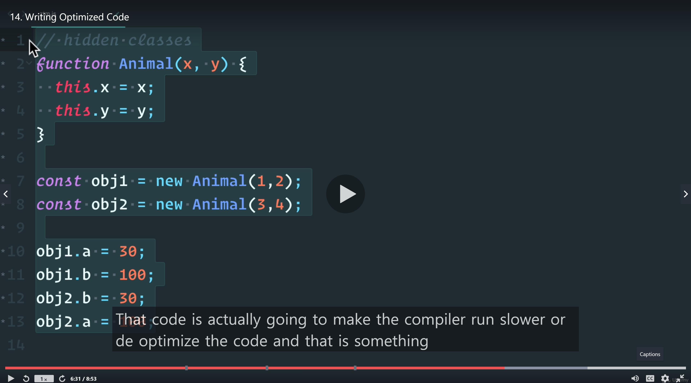

# Writing Optimized Code

- eval(): can be problematic
- arguments : There are many ways that makes compilers unoptimizable. We have to be very careful with using arguments.
- So we are gonna study how we can use parameter destructuring to avoid using arguments.
- for in loop: Rather using this, use object.keys
- with statement, delete can be problematic

