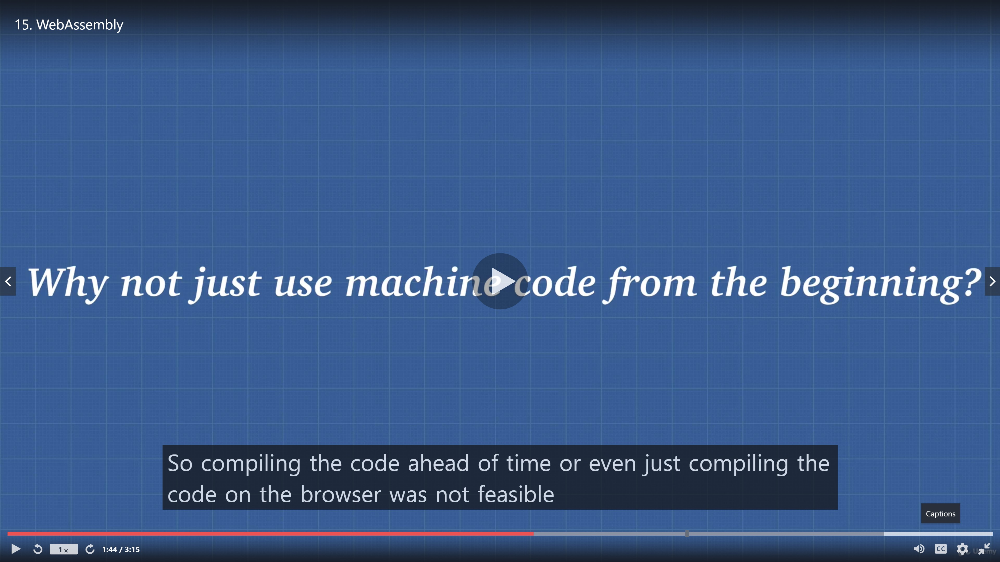
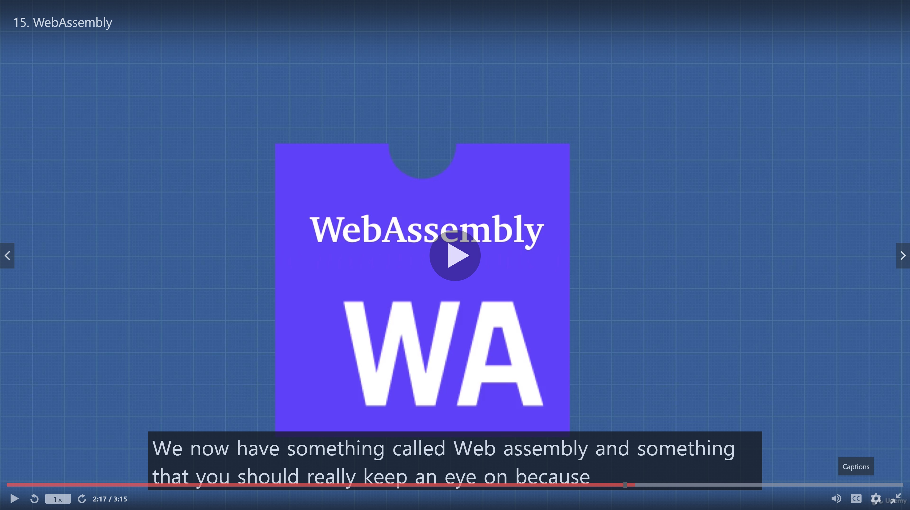

# WebAssembly

- Because back in the day it was really slow.

- This can be a game changer in the future

## We have the standard binary executable format called **WEB ASSEMBLY**

- This is what we didn"t have in 1995 when there were broser wars.

- We didn't have the competing browsers agreeing on this format where we can compile our code all the way down to web assembly this executable format so that it runs really fast on the browser instead of having to go through that entire Javascript engine process.
